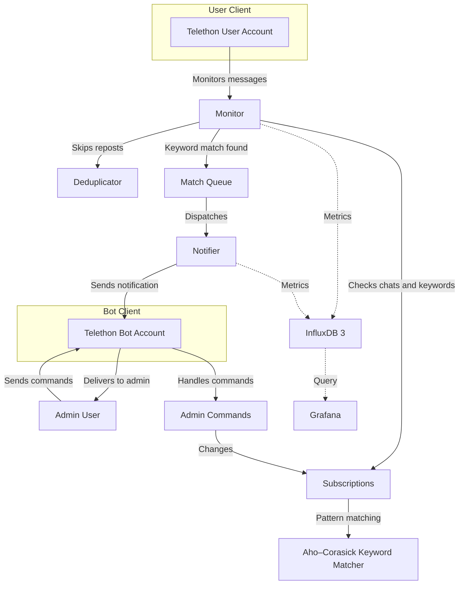
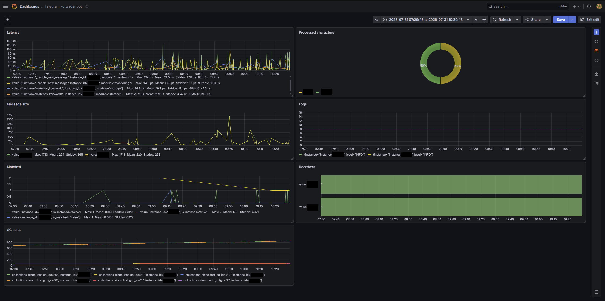

# Telegram Forwarder Bot

> **Note:** Major part of this codebase was generated with **Qwen3.6 35B MoE** running locally via **llama.cpp** and **Zoo Code**. Later versions refined with **Claude Opus 5.5**.

A multi-instance Telegram bot that monitors specified chat groups and topics for keyword matches, forwarding notifications to an admin user in real-time.

## Features

- **Real-time message monitoring** - Listens to messages from multiple Telegram chat groups and discussion forum topics
- **Keyword matching** - Supports AND-grouped keywords with Aho–Corasick automaton-based pattern matching (via `pyahocorasick`)
- **Multi-instance support** - Run multiple independent bot instances, each with its own configuration
- **Flexible subscription model** - Subscribe/unsubscribe to groups via URL links or explicit commands
- **Pause/resume notifications** - Temporarily halt notifications without losing subscriptions
- **Persistent storage** - Keeps subscriptions and the deduplication cache in a JSON file, replaced atomically on every save
- **Metrics collection** - Optional InfluxDB3 integration for performance and usage metrics

## Architecture



## Tech Stack

- **Python 3.12+** with `asyncio` for asynchronous operation
- **Telethon** - Telegram MTProto API client library
- **Click** - Command-line interface framework
- **pyahocorasick** - Fast multi-pattern string matching
- **InfluxDB3** (optional) - Time-series metrics storage

## Production Resource Usage

The bot currently runs as the only workload on a virtual machine with:

- **2 vCPUs**
- **8 GiB RAM**

Observed over the last 30 days, CPU usage typically stays around **5–10%** and peaked at **45%**. RAM usage is usually about **1.6 GB**.

## Prerequisites

- Python 3.12 or higher
- A Telegram API key pair ([get them here](https://my.telegram.org))
- A bot token from [@BotFather](https://t.me/BotFather)
- (Optional) InfluxDB 3 and Grafana for metrics visualization

## Installation

1. Clone this repository:

```bash
git clone git@github.com:rogday/telegram-forwarder-bot.git
cd telegram-forwarder-bot
```

2. Install dependencies:

```bash
pip install -r requirements.txt
```

3. Create an instance directory with static and dynamic configuration files:

```bash
mkdir -p data/my-instance
cp examples/static.yml data/my-instance/.static.yml
cp examples/dynamic.yml data/my-instance/.dynamic.yml
```

4. Edit `data/my-instance/.static.yml` and fill in your credentials:

```yaml
client:
  api_id: 123456
  api_hash: "your_api_hash_here"
  bot_token: "your_bot_token_here"
  admin_id: 123456789
  admin_phone: "+1234567890"
  session_dir: "./sessions"

storage_manager:
  database_path: "./storage.db"

metric_recorder:
  influxdb3:
    endpoint:
    token:
    database_name:
```

The `.dynamic.yml` file contains runtime-reloadable settings such as the timezone, deduplication, metric intervals, request timeouts and retries, logging, and instrumentation. The bot reloads it when the file changes.

Every Telegram request, including the ones Telethon makes to fetch missed updates, has a timeout per attempt and is retried with exponential backoff. If the last attempt fails, the error is logged and the bot carries on.

5. Start the telemetry stack (optional):

```bash
cp examples/compose.env .compose.env
# Set GRAFANA_ADMIN_PASSWORD in .compose.env, then:
docker compose --project-directory . --env-file .compose.env -f deploy/compose.telemetry.yml up -d
```

This starts the shared InfluxDB, Loki, Grafana, and Alloy services. Grafana, InfluxDB, and Alloy listen on all host interfaces by default; Loki remains internal to the Compose network.

### Access telemetry services

Grafana, InfluxDB, and Alloy are reachable through the host address on their published ports:

- Grafana: `http://HOST:3000`
- InfluxDB HTTP API: `http://HOST:8181`
- Alloy diagnostics: `http://HOST:12345`

### Initialize InfluxDB

Create the first administrator token inside the running InfluxDB container and extract the token value into a permission-restricted local file:

```bash
docker compose --project-directory . --env-file .compose.env -f deploy/compose.telemetry.yml exec -T influxdb \
  influxdb3 create token --admin \
  | grep -m1 -o "apiv3_[^[:space:]]*" \
  > .influxdb-token
```

Create the `metrics` database with 15-day retention:

```bash
docker compose --project-directory . --env-file .compose.env -f deploy/compose.telemetry.yml exec influxdb \
  influxdb3 create database \
  --host http://localhost:8181 \
  --token "$(cat .influxdb-token)" \
  --retention-period 15d \
  metrics
```

Configure each containerized bot instance to write to that database in its `.static.yml`:

```yaml
metric_recorder:
  influxdb3:
    endpoint: "http://influxdb:8181"
    token: "apiv3_replace_with_your_token"
    database_name: "metrics"
```

Metrics are tagged with `metric_recorder.telemetry_instance_id`, which defaults to the instance directory name, the same name Loki uses for the `instance` label. Set it only to override that.

### Configure Grafana

Open `http://localhost:3000`, sign in with the administrator credentials from `.compose.env`, and select **Connections → Data sources → Add new data source → InfluxDB**. Configure it as follows:

- Query language: **SQL**
- URL: `http://influxdb:8181`
- Database: `metrics`
- Token: the value stored in `.influxdb-token`
- Advanced database settings → Insecure Connection: **enabled**

Select **Save & test**. SQL is the supported query mode for this dashboard and InfluxDB 3.

The included dashboard also contains a Loki panel. Add the **Loki** data source with URL `http://loki:3100`, then select **Save & test**.

To import the dashboard:

1. Select **Dashboards → New → Import dashboard**.
2. Select **Upload dashboard JSON file** and choose `deploy/grafana-dashboard.json` from this repository.
3. Select the InfluxDB and Loki data sources if Grafana prompts for them.
4. Select **Import**.

The **Heartbeat** panel turns red when heartbeats stop or when the bot reports itself unhealthy, which happens when the user client has not handled a single message from any chat for `monitor.max_silence_seconds` (12 hours by default). Each heartbeat also stores `seconds_since_last_message` in the `health` table for alerting.

### Dashboard preview



## Running the Bot

### Directly with Python

```bash
PYTHONPATH=src python -m telegram_forwarder_bot --env ./data/my-instance
```

The `--env` option points to the instance directory. Relative paths in the configuration are resolved from that directory, so each instance has its own sessions, storage, logs, and profiles.

### As an independent Compose instance

With the telemetry stack already running, start the bot:

```bash
BOT_INSTANCE_ID=my-instance docker compose --project-directory . --env-file .compose.env -f deploy/compose.bot.yml up -d --build
```

To add another instance, create `data/another-instance` with its own two YAML files, then run `BOT_INSTANCE_ID=another-instance docker compose --project-directory . --env-file .compose.env -f deploy/compose.bot.yml up -d`. Each ID gets its own Compose project, container, sessions, storage, and logs. Alloy discovers new `data/<instance>/logs/*.jsonl` files automatically, so its configuration and the telemetry stack do not need to be changed or restarted.

In Loki, every log line has `instance`, `level`, and `source` labels. `source` is `app` for the bot's own code, `telethon.user` or `telethon.bot` for the two Telegram clients, and the top-level package for other libraries, such as `influxdb_client_3` or `urllib3`. The module or logger name is in the `record.name` JSON field, for example `{source="telethon.user"} | json | record_name=~".*updates"`.

Use the same instance ID for lifecycle commands:

```bash
# Follow only this bot logs
BOT_INSTANCE_ID=my-instance docker compose --project-directory . --env-file .compose.env -f deploy/compose.bot.yml logs -f

# Stop and remove only this bot
BOT_INSTANCE_ID=my-instance docker compose --project-directory . --env-file .compose.env -f deploy/compose.bot.yml down
```

Docker keeps at most three 10 MB log files per container, for the bot and the telemetry services alike.

For metrics from a containerized bot, set `metric_recorder.influxdb3.endpoint` in that instance configuration to `http://influxdb:8181`. Leaving the endpoint and token empty keeps metrics export disabled.

## Bot Commands

All commands are sent to the bot directly and are only recognized by the admin user:

| Command | Description |
|---------|-------------|
| `/status` | Show current configuration and status |
| `/pause` | Toggle notification pause/resume |

### Smart Input

The bot interprets each space-separated token as an independent keyword group:

- Sending a space separated **Telegram URLs** (`https://t.me/groupname/topic_id https://t.me/another_groupname/topic_id`) toggles subscription for these groups/topics
- Sending `python_machine-learning` toggles one AND-group containing `python` and `machine-learning`
- Sending `python_machine-learning ubuntu_linux` toggles both groups at once
- Prefixing a keyword with `!` excludes messages containing that keyword from its group, for example `python_!course`

## How Keyword Matching Works

Keywords are organized into **AND-groups**. A message matches a group only if **all** keywords in that group appear somewhere in the message text. Multiple groups are evaluated with **OR** logic - matching any single group triggers a notification.

The bot uses the Aho–Corasick algorithm (via `pyahocorasick`) for efficient multi-pattern string matching across all keyword groups simultaneously.

Examples:

- Group 1: `python_machine-learning` - matches messages containing both "python" AND "machine-learning"
- Group 2: `ubuntu_linux` - matches messages containing both "ubuntu" AND "linux"

A message with "python ubuntu" would **not** match either group, but "python machine-learning" would match Group 1.

Identical message text is treated as a repost and only notifies once while its content hash remains in the configured deduplication cache.

## Running Tests

```bash
pip install -r requirements-dev.txt
python -m pytest
```

## File Structure

```
telegram-forwarder-bot/
├── requirements.txt          # Runtime dependencies
├── requirements-dev.txt      # Runtime and test dependencies
├── deploy/
│   ├── Dockerfile            # Bot runtime image
│   ├── compose.telemetry.yml # Shared telemetry services
│   ├── compose.bot.yml       # Independently managed bot instance
│   ├── alloy.config          # Discovers logs for every bot instance
│   └── grafana-dashboard.json
├── examples/
│   ├── Dashboard.png         # Grafana dashboard preview
│   ├── compose.env           # Portable Compose path and port defaults
│   ├── static.yml            # Credentials and startup configuration
│   └── dynamic.yml           # Runtime-reloadable configuration
├── tools/
│   └── migrate_storage.py    # Converts a pickled storage.db to JSON
└── src/telegram_forwarder_bot/
    ├── __main__.py           # CLI entry point with Click
    ├── main.py               # Async application bootstrap
    ├── bot.py                # Wires the clients and message handlers together
    ├── config.py             # YAML configuration models and loaders
    ├── config_watcher.py     # Reloads .dynamic.yml when it changes
    ├── storage.py            # Subscriptions, keyword matching, deduplication and the storage file
    ├── monitoring.py         # Message monitor and chat entity resolver
    ├── admin_commands.py     # Admin commands, chat links and keyword groups
    ├── notification.py       # Sends matches to the admin
    ├── metrics.py            # InfluxDB 3 performance metrics
    ├── retry.py              # Timeouts and exponential retries
    ├── telegram_client.py    # Telethon client with request timeouts
    └── app_logging.py        # JSON file and stderr logging setup
```

## License

MIT, see [LICENSE](LICENSE).
